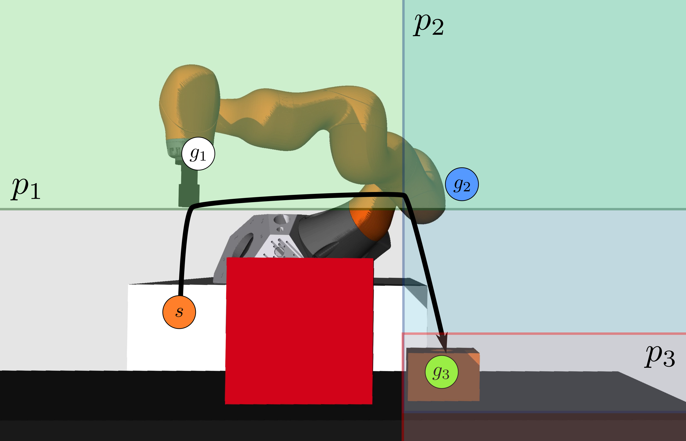
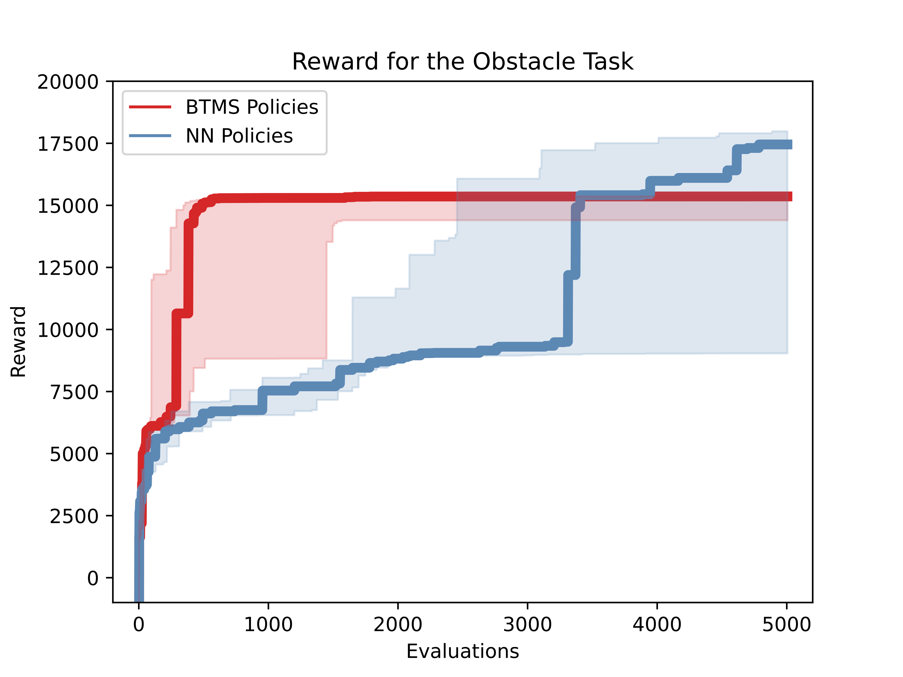
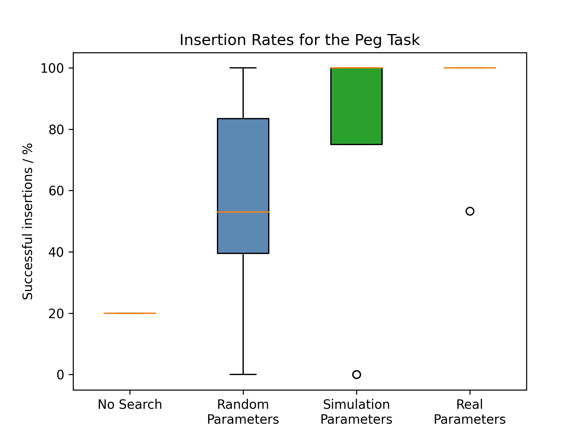

# Behavior Tree Policy (BTMS) Learning Algorithm

Code for the IROS 2021 paper "Learning of Parameters in Behavior Trees for Movement Skills" by Matthias Mayr, Konstantinos Chatzilygeroudis, Faseeh Ahmad, Luigi Nardi and Volker Krueger.

In short, we combine behavior trees (BT), a motion generation and movements skills (MS) to learn robust and interpretable policies. To the best of our knowledge this is the first approach that learns parameters in behavior trees for robot manipulators.


### Code developers/maintainers

- Matthias Mayr - development of the BT integration, domain randomization, BTMS strategy
- Konstantinos Chatzilygeroudis: http://costashatz.github.io/ - development of original [Black-DROPS](https://github.com/resibots/blackdrops) code

*Please note that we forked our own code and work on a different code basis right now. This repository is intended to make our results and ideas accessible for other people, but will not receive major updates.*<br>
The next generation is available here: https://github.com/matthias-mayr/SkiREIL

### Installation and Compilation

- Clone the config git repository:
```
git clone --recursive https://github.com/matthias-mayr/behavior-tree-policy-learning.git
```

- Follow the [basic installation](docs/installation.md) or check out [advanced installation](docs/advanced_installation.md).  tl;dr:
```
./scripts/installation/install_deps.sh
source ./scripts/paths.sh
./scripts/build/configure.sh
./scripts/build/compile.sh
```

### Using the code

The instructions are in the [usage guide](docs/usage.md). You will find detailed guidelines on how to run scenarios. In short, we supply executables for:
- learning policies
- 'playing' existing parameter sets in simulation
- executing results on a real system

### Videos
#### Accompanying Video

[](https://youtu.be/GIBG2QYhx0Q)

#### Conference Presentation

[](https://youtu.be/iEbiC69DnMg)

### Implemented scenarios

<center>

</center>

Please look at the [implemented scenarios page](docs/implemented_scenarios.md). You will find a brief description of all the implemented scenarios and recommended parameters (e.g., number of maximum function evaluations for CMA-ES) for running them.

### Results

#### Obstacle Avoidance
<center>

</center>

- BMTS policies learn faster than feed-forward neural networks
- They produce solutions with less variance
- The results are interpretable and easy to understand compared to a neural network

#### Peg Insertion Task
<center>

</center>

- An insertion policy without learned search parameters achieves a low insertion performance (~20%)
- Randomly sampled solutions from the search space deliver varying performances
- BTMS policies with search parameters learned in simulation achieve a median insertion rate of 100%, but have negative outliers
- Parameters learned directly on the real system achieve the most consistent performance.

### Citing this work

If you use our code for a scientific paper or want to refer to it, please cite:

Mayr, M., Chatzilygeroudis, K., Ahmad, F., Nardi L., Krueger, V. (2021) [Learning of Parameters in Behavior Trees for Movement Skills](https://arxiv.org/abs/2109.13050). *Proceedings of the IEEE/RSJ International Conference on Intelligent Robots and Systems (IROS)*.

In BibTex:
  
    @inproceedings{mayr2021btms,
        title={{Learning of Parameters in Behavior Trees for Movement Skills}},
        author={Mayr, Matthias and Chatzilygeroudis, Konstantinos and Ahmad, Faseeh and Nardi, Luigi and Krueger, Volker},
        booktitle={Proceedings of the IEEE/RSJ International Conference on Intelligent Robots and Systems},
        year={2021},
        organization={IEEE}
    }

### Acknowledgements
This work was partially supported by the [Wallenberg AI, Autonomous Systems and Software Program (WASP)](https://wasp-sweden.org) funded by Knut and Alice Wallenberg Foundation.

This research was also supported in part by affiliate members and other supporters of the Stanford DAWN project—Ant Financial, Facebook, Google, InfoSys, Teradata, NEC, and VMware.
